# Wokshop - Synthese de l'image 

*Ce repository contient deux branches représentant nos deux avancées. 
JeanBranche : Jean LE CHAUDELEC
LucasBranch : Lucas TERRASSON*

### Diamond Square

Le programme est juste une adaptation du pseudo-code de la vidéo de présentation en C++. Mon code est très mal écrit ce qui le rend un peu difficile à lire. Néanmoins voici des exemples de rendu. 


| Duretée     | Image        |
| ------------- |:-------------:| 
| 0.1      | .png) |
| 0.5     | .png)    | 
| 1 | .png)     | 
| 2 | .png)     |


### K-Means

On peut justement voir avec la photo donnée la limite de ce filtre. Il ne prendra pas forcement les K-couleurs les plus représenté. Surtout dans une image où beaucoup de couleurs sont représenté à la même intensité. On peut changer la variable `facteurK` dans le programme pour choisir le nombre de couleur.

Voici des exemples pour plusieurs K :

| K - couleur(s)     | Image        |
| ------------- |:-------------:| 
| 3  (plusieurs essais)    |  |
| 5     |     | 
| 10 |     | 
| 30 |     |

### Filtre de Kuwahara

Mon code prend un peu de temps selon moi, peut-être un soucis d'optimisation. Le rendu est néanmoins très satisfaisant et on peut régler l'intensité via la variable `intensiteFlou`. Il faut bien faire attention que l'image d'entrée du programme est flou, sinon cela va juste retourner une image flou.

Voici plusieurs exemples avec différentes intensitées :

| Intensité de flou de l'entrée | Intensité de la sortie    | Image        |
| --------- | ------------- |:-------------:| 
|1| 2    |  |
|1| 3     |     | 
|1| 6     | 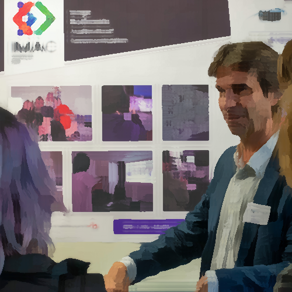    |

<details><summary>Pourquoi pas une intensité plus haute ?</summary>
*Plus on fait une intensité élevée, plus la compleité augmente vite donc moins facile à générer...*
</details>


On peut aussi faire varier l'image flou d'entrée. Plus l'image d'entrée est flou, plus notre "peinture" va sembler imprécise :

| Intensité de flou de l'entrée | Intensité de la sortie    | Image        |
| --------- | ------------- |:-------------:| 
|1| 2    |  |
|3| 2     |     | 
|10| 2     |     |

### Tri de pixels

Pour créer notre rendu final, nous sommes passées par 3 étapes :

#### 1) Trier toute l'image par luminosité :

Le code est particuliérement simple mais au début il mettait du temps à nous sortir un resultat. Cela venait du fait que l'on fesait le tri des pixels un nombre fois égal au nombre de pixels dans l'image... Alors qu'il suffisait de le faire une fois ! :/

Voici donc ce que cela donne : 
*Magnifque !*

#### 2) Trier chaque ligne par luminosité :

Une fois que l'on sait trier l'image, il nous suffit de déterminer les bornes et le nombre d'itération de tris pour trier par ligne.

Voici ce que cela donne : 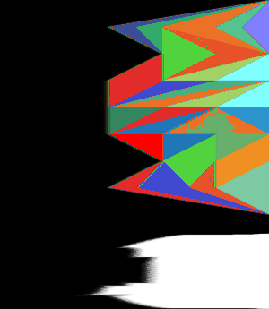

#### 3) Trier des parties aléaroires par luminosité :

Il faut maintenant ajouter de l'aléatoire sur les parties à trier.

Voila ce que l'on obtient : 

### Différences de Gaussiennes

Une fois que l'on sait faire un flou, il suffit de soustraire les couleurs d'une image bien flou aux couleurs de l'image moins flou. Les résultats différent beaucoup en fonction des flous choisies mais aussi en fonction du facteur `facteurBlancNoir` qui va déterminer après soustraction des images si un pixel doit être noir ou blanc.

Voici ce que l'on obtient avec :
```cpp
int intensiteFlou{1};
int intensiteFlouSub{5};
float const facteurBlancNoir{0.2};
```
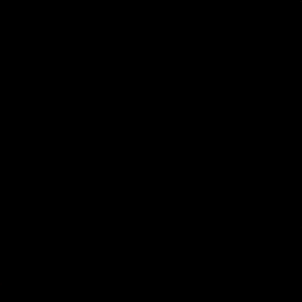


### Filtre séparable

Il suffit de modifier son code de Convolution, ce qui donne :


### Netteté, contours, etc.

Ici, on peut tester plein de matrices différentes :

||||
| --------- | ------------- |-------------| 
|Sharpen|Outline|Emboss|

||||
| --------- | ------------- |-------------| 
|Top Sobel|Bot Sobel|Personnalisé|

### Convolutions

Une fois la méthode compris, il suffit de réfléchir quoi faire lorque l'on dépasse de l'image. Pour cela si notre pixel `x+i` dépasse, on le remplace par `x` (de même pour `y`).
On peut régler l'intensité de flou avec `intensiteFlou` !

Cela nous donne : 

| Intensité de flou    | Image        |
| ------------- |:-------------:| 
| 1    |  |
| 3     |     | 
| 10     |     |

### Normalisation de l'histogramme

Le but ici est de redéfinir l'échelle de définition des couleurs par la luminosité maximale et minimale de l'image.
Pour cela on utilise cette formule :
`image.pixel(x,y) = (image.pixel(x,y)-minBrightness)/(maxBrightness-minBrightness)`

Voici donc le résultat : 
|||
|------|------|
|Avant|Après|

### Tramage

La spécificité de mon programme repose sur le fait que l'on peut choisir le niveau de sa matrice de Bayer pour créer son image. Pour ça, j'ai créer une fonction `generateBayerLevel(int level)` qui fonctionne par itération.
J'ai suivi les explications de [ce site](https://surma.dev/things/ditherpunk/).

Voici donc mes différents rendus :
| Niveau de la matrice de Bayer    | Image        |
| ------------- |:-------------:| 
| 2    |  |
| 5     |     | 
| 10     |     |


*Attention à ne pas mettre un nieau trop grand car si la taille de la matrice dépasse celle de l'image, il y aura une erreur !*

### Vortex

Mon programme fait donc l'effet de Vortex mais l'on peut choisir l'intensité de rotation selon un niveau arbitraire nommé `levelOfRotating`.

Voici les images obtenues :
| Niveau de rotation    | Image        |
| ------------- |:-------------:| 
| 1    |  |
| 3     | 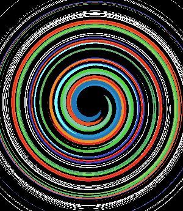    | 
| 5     | 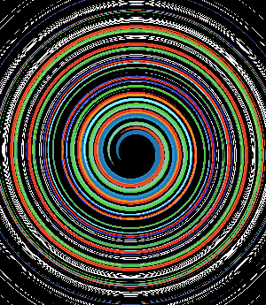    |

Mais si l'on peut régler l'intensité, on peut se demander ce vue nous donne le programme avec des facteurs de plus en plus grands. C'est donc ce que j'ai testé :

|Image||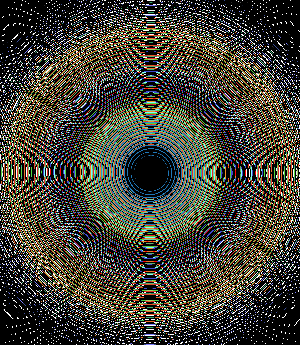|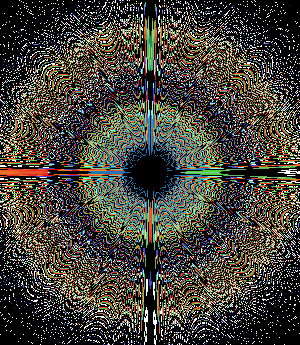|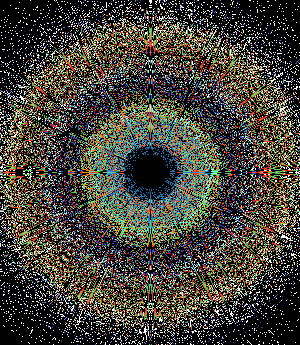|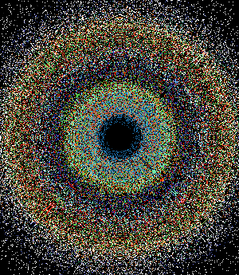|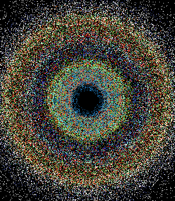|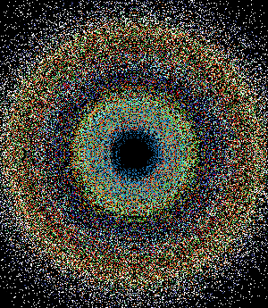|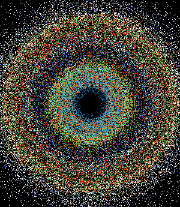
|---|---|---|---|---|---|---|---|---|
|Niveau de rotation|3|30|300|3000|30000|300000|3000000|30000000|

Notre image semble tendre vers une repartion des couleurs assez déstructuré et impossible à prévoir. Mais bon, c'est marrant :) !

### Fractale de Mandelbrot

L'exercice reste assez simple mais il est intéressant ici de recadrer le rendu de l'image pour avoir la partie intéressant. Pour cela, il suffit de définir la valeur initial de notre `std::complex<float> c` en fonction de ce que l'on désire.

Voici le rendu : 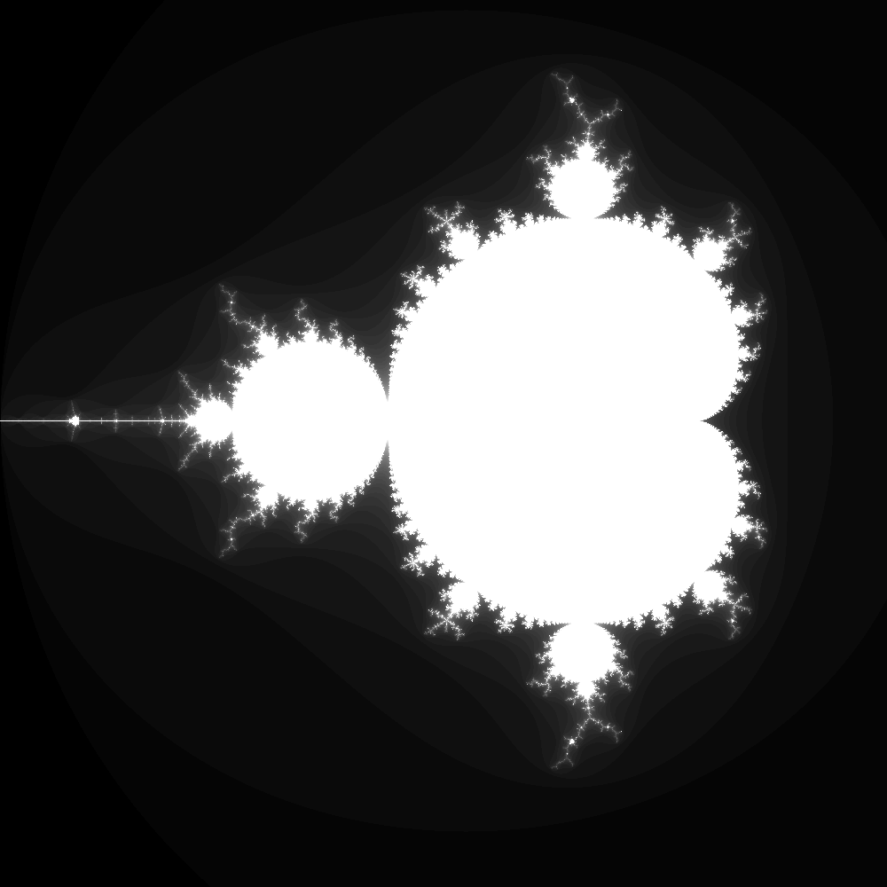

On peut tester avec une opération différente sur notre z :

|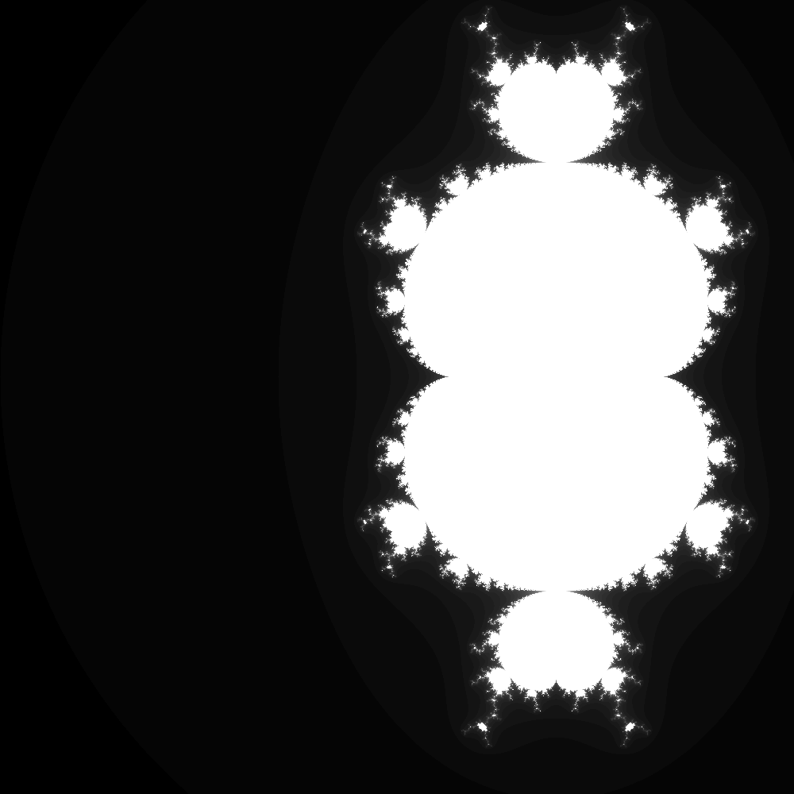|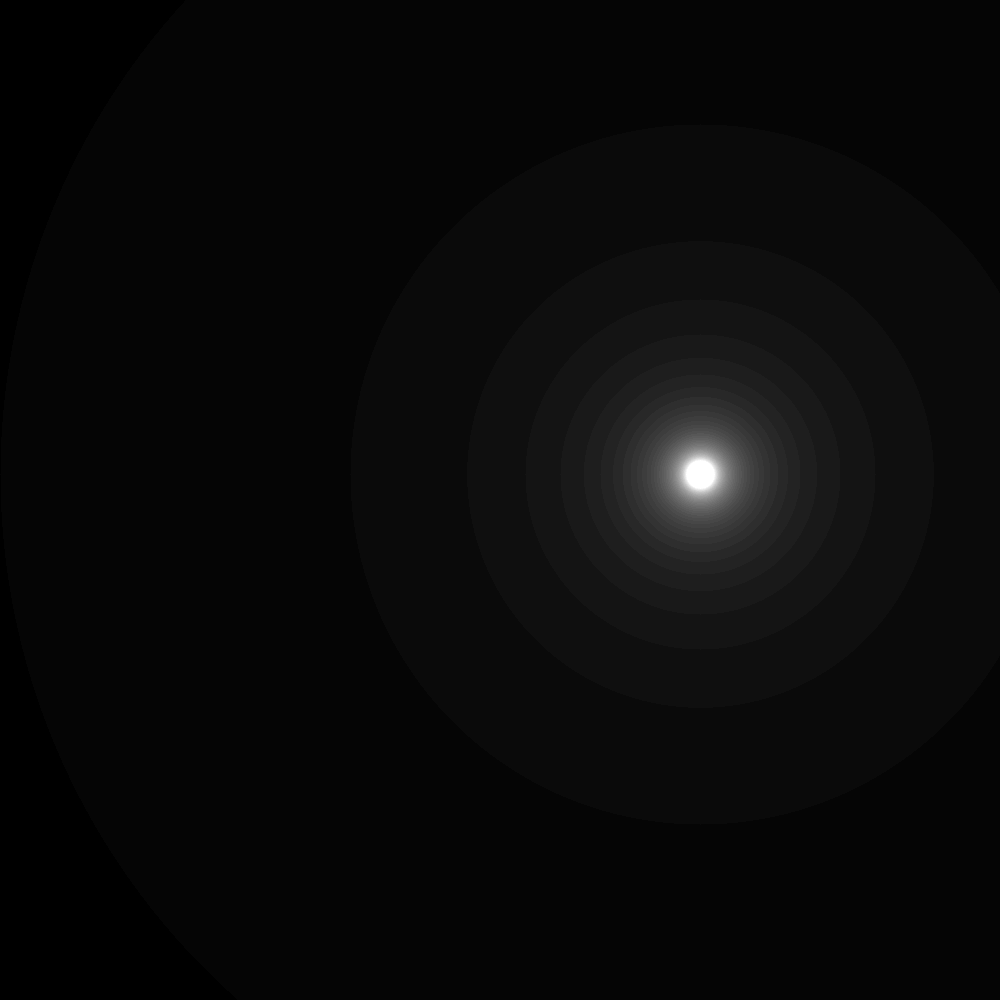|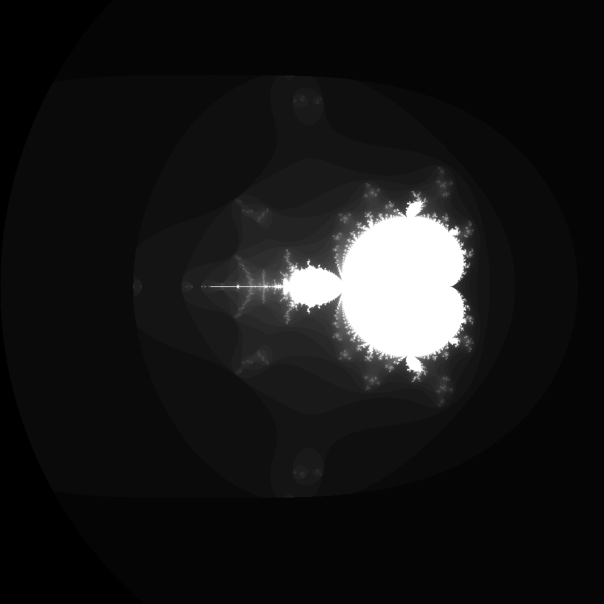|
|------|------|------|
|`z = z*z*z + c`|`z = z + c`|`z = z + c + c`|

### Glitch

On peut choisir le nombre de glitch généré à l'aide de la variable `nbr_glitch`.
Mais on peut vite se rendre compte que mon code n'est pas parfait lorque l'on met un `nbr_glitch` assez grand, les glitchs ne sont pas bien repartis sur les deux côtés car j'esquive tous les problèmes de sortir de l'image dans mon code.

On peut le voir ici :
| Nombre de glitch   | Image        |
| ------------- |:-------------:| 
| 50    |  |
| 100     |     | 
| 500     | 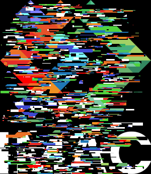    |

*Donc à optimiser...*

### Mosaïque Miroir

Contrairement à ma mosaïque, je ne passe pas par des modulos mais par des `if` qui sont plus complexe MAIS SURTOUT qui rendent mon code plus difficile à lire. Ce serait donc à revoir...

Voici le rendu : 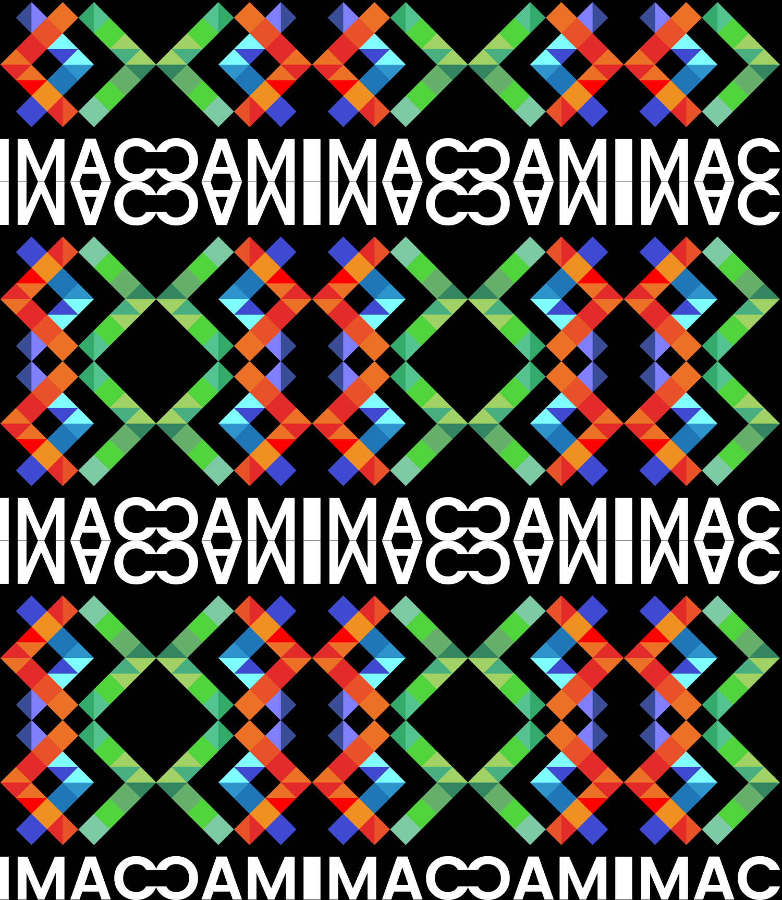

### Mosaïque

Ici, on créer simplement une image plus grande que l'original pour y placer le nombre de mosaïque souhaité. Lors du parcours des pixels sur notre image de sortie, on utilise des `%imageRef.width()` et des `%imageRef.height()` pour parcourir le logo d'origine afin de le répeter sur l'image.

Cela donne : 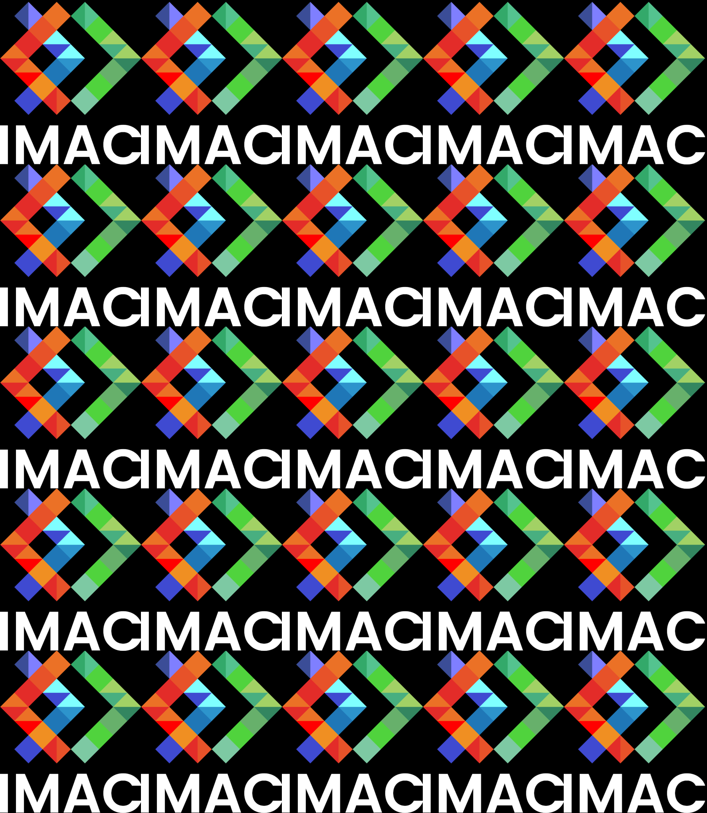

### Rosace

J'ai réglé mon programme de tel sorte à ce que l'on puisse choisir le nombre de pétales de notre rosace à l'aide de `nbrRosace`.

Voici un rendu en modifiant ce nombre :
| Nombre de pétales   | Image        |
| ------------- |:-------------:| 
| 4    | 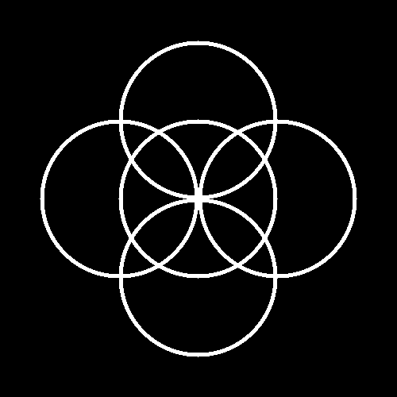 |
| 10     | 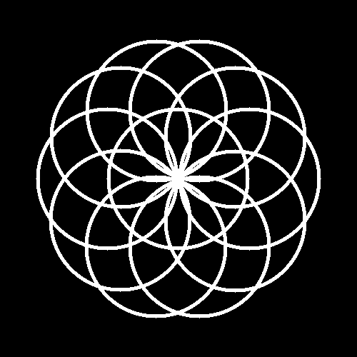    | 
| 100     | 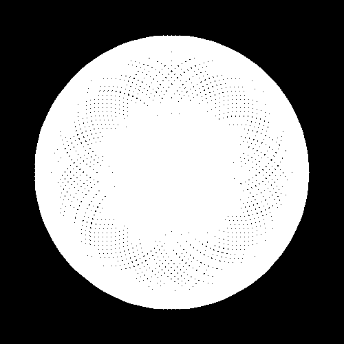    |

### Cercle

On peut modier le rayon du cercle avec la variable `Rayon` et l'épaisseur du trait avec `thickness`.

Voici le plusieurs rendus :
| Rayon| Epaisseur   | Image        |
| ------------- |-------------|-------------|
| 100   |10|  |
| 200     |2| 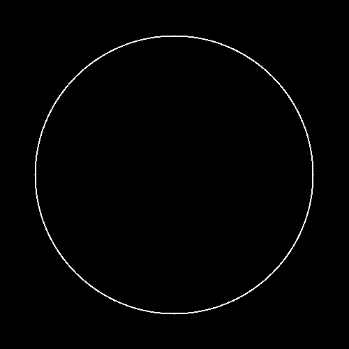    | 
| 150     |80| 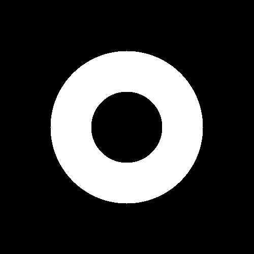    |

### Disque

On peut simplement changer le rayon avec `Rayon`.

Voici l'image : 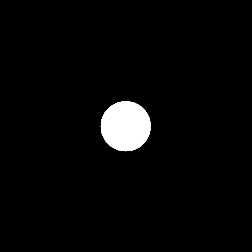

### Luminosité

Pour modifier la luminosité, il suffit d'appliquer la fonction :
$$
f(x) = x^α
$$
où $α∈R^+$.
On distinguera donc deux cas :
    - Si $α∈[0,1]$ :
*<p style="text-align: center;">La luminosité va être augmentée</p>*
    - Si $α∈[1,+\infty{}]$ :

*<p style="text-align: center;">La luminosité va être diminuée</p>*

Dans mon programme on utilisera la variable `intensiteModify` supérieur à 1 qui générera 2 image. Une utilisant la fonction $f$ avec :
$α=intensiteModify$ 
et une autre utilisant :
$α=1/(intensiteModify)$

Voici donc le résultat donné en fonction de `intensiteModify` :

|intensiteModify| Image assombrie   | Image éclaircie      |
| ------------- |-------------|-------------|
| 2   ||  |
| 3     ||     | 
| 10    ||     |

<details><summary>Et si α<0 ?</summary>
Si α est plus petit que 0 alors l'application de notre fonction va faire passer la valeur de chaque couleur au dessus de 1, ce qui va donc donner une image blanche. 
</details>

### RGB Split

Ici mon code n'est pas le plus optimisé. Je passe par 3 conditions pour gérer les problèmes de bords ce qui n'est clairement pas optimal mais fonctionnel.

Voici le résultat : 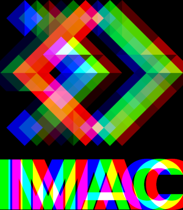

### Rotation de 90°

Il suffit juste d'appliquer la bonne formule.

On a donc : 


### Image bruitée

Le programme nous donne : 


### Mirroir

Le programme nous donne : 


### Dégradé

On a : 


### Négatif

On a :


### Noir & Blanc

On a :


### Echanger les canaux

On a :


### Ne gardez que le vert

On a :
