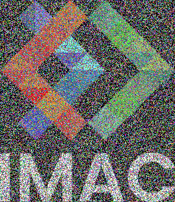
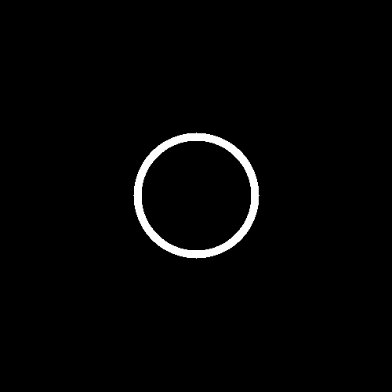
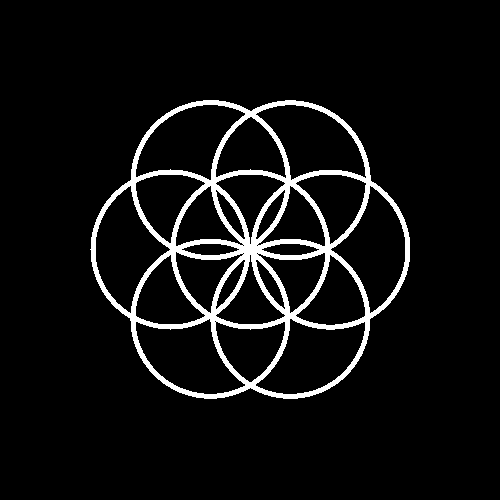
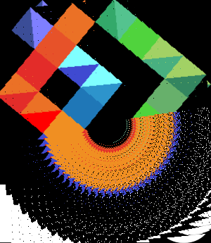
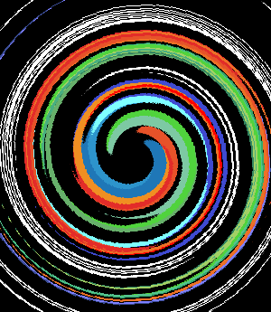

# S1 | Programmation : Workshop

**Jean LE CHAUDELEC**
*IMAC1*

## Exercice 1 : Ne garder que le vert

### Technique : 

Il suffit de mettre les valeurs Rouges et Bleues de chaque pixel de l'image à 0.0

### Image de base :

### Résultat :

## Exercice 2 : Échanger les canaux

### Technique :

On utilise la fonction std::swap. Avec celle-ci on échange les valeurs rouges et bleues de chaque pixel de l'image.

### Image de base :

### Résultat :

## Exercice 3 : Noir & Blanc

### Technique :

L'idée est de déterminer la luminance de chaque pixel. On l'obtient en faisant la moyenne des couleurs de chaque pixel. On remplace ensuite les valeurs R,G et B du pixel en question par la valeur obtenue.

### Image de base :

### Résultat :

## Exercice 4 : Négatif

### Technique :

Ici, l'idée est, pour chaque canal R, G et B de chaque pixel, de soustraire à 1.0 (la valeur max qu'une couleur peut avoir) la valeur R,G ou B du pixel en question.

### Image de base :

### Résultat :

## Exercice 5 : Dégradé

### Technique : 

On effectue cet exercice à partir d'une image entièrement noire. L'idée va être de parcourir chaque pixel de l'image noire et de diviser la valeur x du pixel par la largeur totale de l'image. Le résultat obtenu sera attribué à chaque canal R,G et B du pixel. On peut remarquer que le résultat obtenu sera en nuances de gris étant donné que chaque canal RGB aura la même valeur pour chaque pixel. 
Le résultat obtenu étant compris entre 0.0 et 1.0, la couleur de chaque pixel se situera entre le noir et le blanc. Étant donné que la valeur x augmente d'un pixel à l'autre, plus celle-ci sera grande, plus elle sera proche de 1.0. Ainsi, les pixels les plus à gauche tendront vers le noir, tandis que ceux à droite tendront vers le blanc.

### Résultat :

## Exercice 6 : Miroir

### Technique : 

Le but de cet exercice est d'attribuer à chaque pixel d'une image les couleurs de son pixel opposé. Pour cela, il suffit de soustraire à la largeur maximale de l'image la valeur x du pixel en question.

### ATTENTION !!!

Si on effectue l'opération avec une seule image, lorsque x est supérieur à (largeur max/2), le programme va prendre les couleurs des pixels qui ont déjà été modifiés. Cela ne va pas créer un effet miroir mais un effet de symétrie axiale (voir erreur ci-dessous).
Pour pallier ce problème, il faut créer une seconde image qui servira à afficher le résultat.

### Image de base :

### Erreur :

### Résultat :

## Exercice 7 : Image buitée

### Technique :

Ici, l'idée est de sélectionner des coordonnées aléatoires x et y sur notre image. Cela va nous permettre de sélectionner des pixels de manière aléatoire. Il suffit ensuite de sélectionner des valeurs aléatoire, comprises entre 0.0 et 1.0, pour les canaux RGB de chaque pixel sélectionné.

### Image de base :

### Résultat :

## Exercice 8 : Rotation à 90°

### Technique :

Pour réaliser une rotation de 90°, on peut inverser les coordonnées des pixels de l'image (on remplace les coordonnées x par les coordonnées y et on remplace les y par les x). On obtient bien une image tournée à 90 degrés mais pas dans le sens désiré. Il va donc falloir appliquer un miroir sur l'image obtenue.

### ATTENTION : 

Cette technique nécessite encore une fois l'utilisation d'une seconde image. Cependant, notre logo possède une hauteur plus grande que sa largeur. Pour effectuer une rotation de 90°, il est nécessaires d'inverser les valeurs de largeur et de hauteur de la seconde image. 
De plus, pour appliquer le miroir à la fin, il faut utiliser une troisième image.

### Image de base :

### Résultat :

## Exercice 9 : RGB Split

### Technique :

Ici, le but est d'attribuer à chaque pixel les couleurs d'un pixel qui se trouve à côté de lui (un pixel de même ordonnée y mais d'abscisse x différent). 

### ATTENTION :

Dans certains cas, le programme sélectionne des pixels qui se trouvent en dehors des limites de l'image, ce qui met le programme en échec. Il faut donc gérer les différents cas où cela se produit.

### Image de base :

### Résultat :

## Exercice 10 : Luminosité

### Technique :

Le but de l'exercice est de trouver une formule qui permet d'augmenter ou de diminuer la luminosité d'une image. Le principe est le même que celui de la courbe de Photoshop. Pour avoir un résultat similaire il faut appliquer des puissances aux valeurs RGB de chaque pixel. L'application de puissances entières permet de diminuer la luminosité. L'application de puissances avec un exposant compris entre 0 et 1 permet d'augmenter la luminosité (si l'exposant est à 0, l'image est totalement blanche). 

### Image de base :

### Résultat (avec une puissance de 2) :

## Exercice 11 : Disque

### Technique :

Cet exercice s'applique sur une image totalement noire. Il faut tout d'abord définir la taille du rayon de notre disque. L'idée est ensuite de trouver tous les pixels qui se trouvent à l'intérieur de notre disque et de les mettre en blanc. L'aire d'un disque étant de pi * rayon^2, il faut vérifier si la distance de chaque pixel par rapport au centre du disque est inférieure ou égale à rayon^2. Si c'est le cas, le pixel en question est bien un pixel de notre disque. On le passe en blanc. Si ce n'est pas le cas, il n'appartient pas à notre disque. On le laisse en noir.

### Résultat :

## Exercice 12 : Cercle

### Technique :

Le principe est le même que pour le disque, à l'exception du fait que, contrairement à un disque, un cercle n'est pas plein. De ce fait, il va falloir éliminer les pixels qui sont en dehors, mais aussi ceux qui sont à l'intérieur de notre cercle. L'idée va donc être de vérifier si les pixels à l'intérieur de notre cercle sont inférieur à (rayon - x)^2 où x est une valeur légèrement inférieure à rayon. Si c'est le cas, les pixels en question n'appartiennent pas à notre cercle. On les laisse en noir. La valeur de x dépend de l'épaisseur qu'on veut donner au contour de notre cercle. On obtient ainsi un cercle avec un contour d'épaisseur x.

### Résultat :

## Exercice 13 : Rosace

### Technique :

Le principe de la rosace est de tracer un certain nombre de cercles autour d'un premier cercle. Le centre de chaque cercle supplémentaire se trouve sur le contour du premier. L'enjeu est de trouver la position du centre de chaque cercle supplémentaire et de le tracer ensuite. Dans un premier temps, on trace le premier cercle. L'idée est ensuite de déterminer un angle puis de multiplier celui-ci par le numéro du cercle à tracer (ce nombre s'itère à chaque nouveau cercle tracé). En multipliant le rayon par le sinus de cet angle on obtient l'ordonnée du centre du cercle à tracer. En multipliant le rayon par le cosinus on obtient l'abscisse du centre. Une fois les coordonnées obtenues, il ne reste plus qu'à tracer le cercle correspondant.

### Résultat :

## Exercice 14 : Mosaique

### Technique :

Pour créer une mosaïque à partir d'une image1, il faut trouver le moyen de reproduire la même image1 un certain nombre de fois en abscisse et en ordonnée. L'idée est de créer une image vierge qui va être x fois plus grande que l'image de base. On va ensuite parcourir tous les pixels l'image vierge en divisant la valeur x de chaque pixel de l'image2 par la largeur de l'image1 et en divisant la valeur y de chaque de l'image2 par la hauteur de l'image1. Le reste ce ces divisions permet d'associer chaque pixel de l'image2 à un pixel de l'image1 et ainsi de lui attribuer la même couleur. Cette technique permet ainsi de reproduire la même image plusieurs fois, chaque pixel de l'image 2 se trouvant associé à un pixel de l'image originale.

### Image de base :

### Résultat :

## Exercice 15 : Mosaique miroir

### Technique :

Pour cet exercice, au contraire de la mosaïque normale,  un effet miroir est appliqué sur chaque image reproduite par rapport à celle qui la précède. L'effet miroir peut être appliqué en abscisse comme en ordonnée. L'enjeu est de comprendre à quel position se trouve chaque pixel de l'image2 pour savoir quel miroir lui appliquer (en x, en y, en x et y, aucun miroir). Le reste de la division de chaque valeur x ou y de chaque pixel par 2 permet de savoir quel miroir va lui être appliqué. Si x n'est pas divisible par 2, un miroir en x va être effectué. Si y n'est pas divisible par 2, un miroir en y va être effectué sur le pixel. Si les deux ne sont pas divisibles par 2, un miroir sera appliqué au pixel en x et y. Si les deux sont divisibles par 2, aucun miroir ne sera appliqué. De la même manière que pour la mosaïque classique, chaque pixel de l'image 2 sera associé à un pixel de l'image1.

### Image de base :

### Résultat :

## Exercice 16 : Glitch

### Technique :

Pour effectuer un effet glitch sur une image donnée, il faut utiliser deux images identiques. Le principe est de délimiter dans un premier temps un rectangle sur la première image. Ensuite, il faut délimiter un rectangle de même taille mais de position différente sur la deuxième image. L'idée est d'attribuer aux pixels du deuxième rectangle, la couleur de ceux du premier. Le fait de répéter cette opération plusieurs fois permet de créer un effet de glitch. Il ne reste plus qu'à afficher la seconde image

### Image de base :

### Résultat :

## Exercice 17 : Fractale de Mandelbrot

### Technique :

La fractale de Mandelbrot se créée sur une image noire. Elle s'obtient à partir d'opérations effectuée sur des nombres complexes pour chaque pixel de l'image. Un premier nombre complexe c est définit à partir des coordonnées du pixel en question (x = partie réelle, y = partie imaginaire). Un second nombre complexe z est initié à 0. On effectue un certain nombre de fois l'opération z = z * z + c. Si z augmente, cela veut dire que le pixel n'est pas compris dans la fractale, auquel cas il est noir. Si z reste constant, cela veut dire que le pixel appartient à la fractale, on le passe en blanc. L'utilisation d'une boucle while qui va effectuer un certain nombre de fois l'opération permet de vérifier l'appartenance ou non d'un pixel à la fractale. 

### ATTENTION :

Le nombre c doit être compris entre -2 et 2 pour que la fractale soit visible. Il faut donc effectuer un produit en croix sur les valeurs x et y de chaque pixel pour que c soit compris dans cet intervalle.

### Résultat :

## Exercice 18 : Vortex

### Technique :

Le principe du vortex est d'appliquer une rotation sur chaque pixel de l'image, plus ou moins grande en fonction de la distance de celui-ci par rapport au centre de l'image. Une fonction prédéfinie permet de faire cela en utilisant des vecteurs 2D. Cette fonction a comme paramètre d'entrée la position du pixel, la position de l'origine et l'angle de rotation. L'angle en question se trouve en multipliant le rayon (distance origine - position du pixel) par un angle prédéfinit.

### ATTENTION :

Il faut veiller à ce que les pixels, après rotation, ne se trouvent pas au delà des limites de l'image.

### Image de base :

### Erreur :

Ci-dessous, le résultat obtenu après avoir inversé par mégarde les valeurs x,y et xi,yi dans mon programme.

### Résultat :

## Exercice 19 : Tramage

### Technique :

La réalisation du tramage nécessite l'emploi dans un premier temps d'une matrice de Bayer. Pour cet exercice, j'en ai utilisé une de dimensions 4*4. Ensuite, il faut passer l'image choisie en noir et blanc et la parcourir pixel par pixel. L'idée est d'ajouter à la couleur de chaque pixel une valeur de la matrice (l'image étant en noir et blanc, les composantes RGB ont toutes trois les mêmes valeurs par pixel). Si le nombre obtenu est supérieur à 1/2, la couleur du pixel sera blanche. Si ce n'est pas le cas, elle sera noire.

### Image de base :

### Résultat :

## Exercice 20 : Normalisation de l'Histogramme

### Technique :

Le but principe cet exercice est de modifier une photo à très faible contraste pour en améliorer son rendu visuel. Pour se faire, d’après l’énoncé, il nous faut déterminer le pixel le plus lumineux et le plus sombre. L’idée est ensuite de transformer tous les pixels pour que le pixel le plus sombre soit complètement noir tandis que le pixel le plus clair soit entièrement blanc. La meilleure option est de trouver une formule qui va s’appliquer de la même manière sur tous les pixels. Dans un premier temps il nous faut trouver la luminance du pixel le plus lumineux (appelée luminance max) et la luminance du pixel le plus sombre de l'image (appelée luminance min). Ensuite, le but est d'appliquer sur chaque couleur RGB de chaque pixel la formule qu'on aura trouvé. Celle-ci équivaut à  : (la couleur RGB du pixel - la luminance minimale) / (luminance max - luminance min)

### ATTENTION :

On pourrait être tenté d'utiliser deux formules, l'une pour rendre le pixel le plus sombre noir, l'autre pour rendre le pixel le plus lumineux blanc. Le problème est, qu'en procédant ainsi, on obtient des pixels très sombres et des des pixels très lumineux, avec aucun entre-deux.

### Image de base :

### Résultat :

## Exercice 21 : Convolutions

### Technique :

La convolution est un procédé qui vise à implémenter divers effet. Dans le cas de cet exercice, le but est de créer un effet de flou. Pour cela, il faut faire la moyenne des couleurs Rouges, Vertes et Bleues des pixels autour d'un pixel donné. Les valeurs trouvées seront ensuite attribuées aux canaux RGB du pixel en question. Plus l'opération engagera un nombre important de pixels, plus l'effet de flou sera dense. Le programme convolution parcours tous les pixels d'une image. Il fait la moyenne des couleurs RGB des pixels autour de chaque pixel. Il entre ensuite les valeurs obtenu dans les canaux du pixel en question. Il procède ainsi pour tous les pixels de l'image.

### ATTENTION :

Dans certains cas, concernant le champs de pixels choisi, il se peut que certains pixels soient en dehors des limites de l'image. On peut choisir de ne pas les prendre en compte dans le calcul de la moyenne. Cela fonctionne, mais l'effet de flou sur les pixels concernés n'est pas optimal. La meilleure solution est de faire comme s'il s'agissait de pixels noirs.

### Image de base :

### Résultat :

